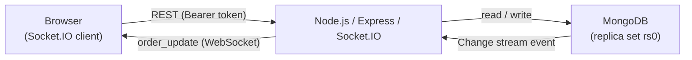

# Order Monitor

Realtime order dashboard: database changes propagate to every connected browser without polling.

---

## Architecture

```
┌────────────────────────────────────────────────────────────────┐
│  Browser (Socket.IO client)                                    │
│    • Renders orders table + event feed                         │
│    • On reconnect → re-fetches /orders to catch missed events  │
└───────────────────────────┬────────────────────────────────────┘
                            │ WebSocket (Socket.IO)
                            │ REST (fetch with Bearer token)
┌───────────────────────────▼────────────────────────────────────┐
│  Node.js  /  Express  /  Socket.IO server                      │
│    • REST routes: read/write MongoDB only                      │
│    • Change stream: sole emitter of order_update events        │
│    • Resume token: picks up from last position after restart   │
│    • Room-scoped emits: io.to(room).emit(…)                    │
└───────────────────────────┬────────────────────────────────────┘
                            │ MongoDB driver (change stream)
┌───────────────────────────▼────────────────────────────────────┐
│  MongoDB (replica set rs0)                                     │
│    • orders collection                                         │
│    • Change stream: INSERT / UPDATE / DELETE notifications     │
└────────────────────────────────────────────────────────────────┘
```

Or as a Mermaid diagram:



---

## Setup

### Option A — Docker (fastest path)

```bash
docker compose up
```

This starts:
- A MongoDB replica set (`rs0`) container — change streams work immediately.
- The Node.js app on port 5000.

Then open <http://localhost:5000>.

To seed sample data:

```bash
docker compose exec app node seed.js
```

### Option B — Local Node.js + MongoDB

1. **Install dependencies:**

   ```bash
   npm install
   ```

2. **Copy `.env.example` to `.env`** and update as needed:

   ```env
   PORT=5000
   MONGODB_URI=mongodb://127.0.0.1:27017
   MONGODB_DB=realtime_orders
   MONGODB_COLLECTION=orders
   # Leave blank to disable bearer-token auth (development only)
   API_TOKEN=
   ```

3. **Start MongoDB as a replica set** (required for change streams):

   ```bash
   mongod --dbpath C:\data\db --replSet rs0
   ```

   Then initialise once in `mongosh`:

   ```javascript
   rs.initiate()
   ```

4. **Seed sample orders:**

   ```bash
   npm run seed
   ```

5. **Start the server:**

   ```bash
   npm start
   ```

6. Open <http://localhost:5000>.

---

## API

All routes require a `Bearer` token when `API_TOKEN` is set in `.env`.

| Method | Route | Description |
|--------|-------|-------------|
| `GET` | `/orders?limit=50&cursor=<id>` | Paginated order list (cursor = last `_id`) |
| `POST` | `/orders` | Create order |
| `PATCH` | `/orders/:id` | Update order fields |
| `DELETE` | `/orders/:id` | Delete order |
| `GET` | `/health` | Health check |

---

## Security

### Bearer-token authentication

Set `API_TOKEN` in `.env` to a strong random string:

```bash
node -e "console.log(require('crypto').randomBytes(32).toString('hex'))"
```

All REST endpoints return `401` if the `Authorization: Bearer <token>` header is missing or wrong.

Socket.IO connections are rejected unless the client passes the same token in the handshake:

```js
const socket = io({ auth: { token: 'your-token' } });
```

Leave `API_TOKEN` empty (or unset) to disable auth — useful for local development.

> **Note:** The browser client reads `window.__API_TOKEN__` injected by the server. For a
> production deployment, inject it via a `<script>` tag server-rendered into `index.html`
> (never commit real tokens to source).

---

## Running tests

```bash
npm test
```

Uses the Node.js built-in test runner (`node --test`). Requires MongoDB running as a replica set.

Tests cover:
- `POST /orders` → `201` + correct document shape.
- `POST /orders` → triggers a Socket.IO `order_update` event with `operation: 'INSERT'`.

---

## Test database changes (Compass or mongosh)

```javascript
use realtime_orders

db.orders.insertOne({
  customer_name: "Your Name",
  product_name: "Mouse",
  status: "pending",
  created_at: new Date(),
  updated_at: new Date()
})

db.orders.updateOne(
  { customer_name: "Your Name" },
  { $set: { status: "delivered", updated_at: new Date() } }
)
```

The dashboard at <http://localhost:5000> updates without a page refresh.

---

## Design Decisions & Tradeoffs

### Why change streams over polling?

Polling introduces a fixed latency equal to the poll interval and burns database I/O even when nothing has changed. Change streams are push-based: the server receives a notification within milliseconds of a write, with zero wasted reads. This also scales well — a single open cursor (change stream) serves any number of Socket.IO clients.

### Why MongoDB change streams over Postgres `LISTEN/NOTIFY`?

Both are valid. `LISTEN/NOTIFY` is simple and works on any Postgres installation. MongoDB change streams were chosen here because:

- They are built on the oplog, which means they survive connection blips via **resume tokens** — a feature with no native equivalent in `LISTEN/NOTIFY`.
- The change event includes a full copy of the updated document (`fullDocument: 'updateLookup'`), eliminating the need for a follow-up `SELECT`.
- Resume tokens and Postgres logical replication are both viable for production; the design here maps naturally to the MongoDB data model already in use.

### Delivery guarantee

| Layer | Guarantee |
|-------|-----------|
| Change stream + resume token | Server replays any events missed during a server restart |
| `socket.on('connect')` refetch | Client re-fetches the full order list on every (re)connect, catching events missed while the WebSocket was down |
| Combined | At-least-once delivery to the browser; duplicates are idempotent (upsert by `_id`) |

---

## Scaling Beyond a Single Instance

### Room-scoped emits

The server emits events to named Socket.IO rooms instead of broadcasting globally. Clients join a room via `socket.handshake.auth.room` (e.g. `'customer:42'` or the default `'all_orders'` room). This reduces unnecessary work on clients that do not need every event.

### Socket.IO Redis adapter for multi-instance

When running more than one Node.js process (horizontal scaling or PM2 cluster), Socket.IO rooms exist only in process memory. Add the Redis adapter to synchronise:

```bash
npm install @socket.io/redis-adapter ioredis
```

```js
const { createAdapter } = require('@socket.io/redis-adapter');
const { createClient } = require('ioredis');

const pub = createClient({ host: 'redis' });
const sub = pub.duplicate();
io.adapter(createAdapter(pub, sub));
```

### Single change-stream owner instance

Only **one** process should own the change stream and emit to Redis (to avoid duplicate events). Elect an owner using:

- A distributed lock in Redis (e.g. `SET lock NX EX 30`).
- Kubernetes leader election.
- A dedicated "change-stream worker" deployment separate from the API servers.

All API server instances subscribe to Redis and relay events to their own connected sockets; only the owner process reads from MongoDB.
