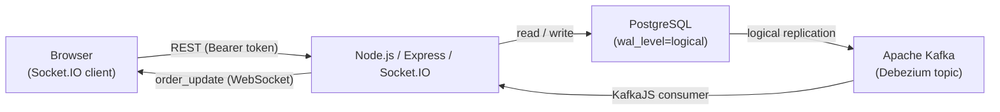

# Order Monitor

Realtime order dashboard: database changes propagate to every connected browser without polling.

---

## Architecture

```
┌────────────────────────────────────────────────────────────────┐
│  Browser (Socket.IO client)                                    │
│    • Renders orders table + event feed                         │
│    • On reconnect → re-fetches /orders to catch missed events  │
└───────────────────────────┬────────────────────────────────────┘
                            │ WebSocket (Socket.IO)
                            │ REST (fetch with Bearer token)
┌───────────────────────────▼────────────────────────────────────┐
│  Node.js  /  Express  /  Socket.IO server                      │
│    • REST routes: read/write PostgreSQL only                   │
│    • Kafka consumer: sole emitter of order_update events       │
│    • Room-scoped emits: io.to(room).emit(…)                    │
└───────────────────────────┬────────────────────────────────────┘
                            │ KafkaJS consumer
┌───────────────────────────▼────────────────────────────────────┐
│  Apache Kafka                                                  │
│    • Topic: ordermonitor.public.orders                         │
│    • Produced by Debezium Postgres connector                   │
└───────────────────────────┬────────────────────────────────────┘
                            │ Debezium CDC (logical replication)
┌───────────────────────────▼────────────────────────────────────┐
│  PostgreSQL (wal_level=logical)                                │
│    • orders table                                              │
│    • INSERT / UPDATE / DELETE → Debezium → Kafka → Node.js    │
└────────────────────────────────────────────────────────────────┘
```

Or as a Mermaid diagram:


```mermaid
flowchart LR
    Browser["Browser\n(Socket.IO client)"]
    Server["Node.js / Express / Socket.IO"]
    Kafka["Apache Kafka\n(Debezium topic)"]
    Postgres["PostgreSQL\n(wal_level=logical)"]

    Browser -- "REST (Bearer token)" --> Server
    Server -- "order_update (WebSocket)" --> Browser
    Postgres -- "logical replication" --> Kafka
    Kafka -- "KafkaJS consumer" --> Server
    Server -- "read / write" --> Postgres
```

---

## Setup

### Option A — Docker (fastest path)

```bash
docker compose up
```

This starts:
- **PostgreSQL** with `wal_level=logical` for Debezium CDC.
- **Zookeeper + Kafka** (Confluent 7.6) single-node broker.
- **Debezium Kafka Connect** with the Postgres connector pre-configured.
- The **Node.js app** on port 5000.

Then open <http://localhost:5000>.

To seed sample data:

```bash
docker compose exec app node seed.js
```

To register the Debezium connector (if not auto-registered):

```bash
bash debezium/register.sh
```

### Option B — Local Node.js + external services

1. **Install dependencies:**

   ```bash
   npm install
   ```

2. **Copy `.env.example` to `.env`** and update as needed:

   ```env
   PORT=5000
   PG_HOST=localhost
   PG_PORT=5432
   PG_USER=orderuser
   PG_PASSWORD=orderpass
   PG_DATABASE=ordersdb
   KAFKA_BROKER=localhost:9092
   KAFKA_TOPIC=ordermonitor.public.orders
   # Leave blank to disable bearer-token auth (development only)
   API_TOKEN=
   ```

3. **Start PostgreSQL** with logical replication enabled:

   ```bash
   # Example using Docker:
   docker run -d --name postgres \
     -e POSTGRES_USER=orderuser \
     -e POSTGRES_PASSWORD=orderpass \
     -e POSTGRES_DB=ordersdb \
     -p 5432:5432 \
     postgres:16-alpine \
     postgres -c wal_level=logical -c max_replication_slots=4 -c max_wal_senders=4
   ```

4. **Apply the schema:**

   ```bash
   psql -h localhost -U orderuser -d ordersdb -f db/init.sql
   ```

5. **Start Kafka + Debezium** (see `docker-compose.yml` for reference config).

6. **Register the Debezium connector:**

   ```bash
   bash debezium/register.sh
   ```

7. **Seed sample orders:**

   ```bash
   npm run seed
   ```

8. **Start the server:**

   ```bash
   npm start
   ```

9. Open <http://localhost:5000>.

---

## API

All routes require a `Bearer` token when `API_TOKEN` is set in `.env`.

| Method | Route | Description |
|--------|-------|-------------|
| `GET` | `/orders?limit=50&cursor=<id>` | Paginated order list (cursor = last `id`) |
| `POST` | `/orders` | Create order |
| `PATCH` | `/orders/:id` | Update order fields |
| `DELETE` | `/orders/:id` | Delete order |
| `GET` | `/health` | Health check |

---

## Security

### Bearer-token authentication

Set `API_TOKEN` in `.env` to a strong random string:

```bash
node -e "console.log(require('crypto').randomBytes(32).toString('hex'))"
```

All REST endpoints return `401` if the `Authorization: Bearer <token>` header is missing or wrong.

Socket.IO connections are rejected unless the client passes the same token in the handshake:

```js
const socket = io({ auth: { token: 'your-token' } });
```

Leave `API_TOKEN` empty (or unset) to disable auth — useful for local development.

> **Note:** The browser client reads `window.__API_TOKEN__` injected by the server. For a
> production deployment, inject it via a `<script>` tag server-rendered into `index.html`
> (never commit real tokens to source).

---

## Running tests

```bash
npm test
```

Uses the Node.js built-in test runner (`node --test`). Requires PostgreSQL running and accessible.

Tests cover:
- `POST /orders` → `201` + correct document shape (integer `id`, all fields present).
- `POST /orders` → triggers a Socket.IO `order_update` event with `operation: 'INSERT'`.

---

## Test database changes (psql or any Postgres client)

```sql
-- Connect to the database
\c ordersdb

-- Insert a new order
INSERT INTO orders (customer_name, product_name, status, created_at, updated_at)
VALUES ('Your Name', 'Mouse', 'pending', NOW(), NOW());

-- Update an order
UPDATE orders
SET status = 'delivered', updated_at = NOW()
WHERE customer_name = 'Your Name';
```

The dashboard at <http://localhost:5000> updates without a page refresh (requires Debezium + Kafka running).

---

## Design Decisions & Tradeoffs

### Why Debezium CDC over polling?

Polling introduces a fixed latency equal to the poll interval and burns database I/O even when nothing has changed. Debezium uses PostgreSQL logical replication (`wal_level=logical`), which is push-based: changes are streamed from the WAL within milliseconds of a write, with zero wasted reads.

### Why Kafka as the CDC transport?

Kafka decouples the database change stream from the application:
- **Durability**: events are persisted in Kafka and can be replayed.
- **Offset management**: the Kafka consumer group tracks its position, equivalent to MongoDB's resume tokens — the server picks up exactly where it left off after a restart.
- **Scalability**: multiple consumer instances can read the same topic; Kafka handles fan-out without extra work from the database.

### Delivery guarantee

| Layer | Guarantee |
|-------|-----------|
| Debezium + Kafka offset | Server replays any events missed during a restart |
| `socket.on('connect')` refetch | Client re-fetches the full order list on every (re)connect, catching events missed while the WebSocket was down |
| Combined | At-least-once delivery to the browser; duplicates are idempotent (upsert by `id`) |

---

## Scaling Beyond a Single Instance

### Room-scoped emits

The server emits events to named Socket.IO rooms instead of broadcasting globally. Clients join a room via `socket.handshake.auth.room` (e.g. `'customer:42'` or the default `'all_orders'` room). This reduces unnecessary work on clients that do not need every event.

### Socket.IO Redis adapter for multi-instance

When running more than one Node.js process (horizontal scaling or PM2 cluster), Socket.IO rooms exist only in process memory. Add the Redis adapter to synchronise:

```bash
npm install @socket.io/redis-adapter ioredis
```

```js
const { createAdapter } = require('@socket.io/redis-adapter');
const { createClient } = require('ioredis');

const pub = createClient({ host: 'redis' });
const sub = pub.duplicate();
io.adapter(createAdapter(pub, sub));
```

### Single Kafka consumer owner instance

Only **one** process should own the Kafka consumer group to avoid duplicate events being emitted to clients. For multi-instance deployments, use a dedicated "change-stream worker" deployment separate from the API servers, or rely on Kafka's native consumer group protocol which assigns partitions exclusively to one consumer per group.
